# TUDAO Customer Scope Agent - Workflow Diagrams

## 1. High-Level Customer Journey

```mermaid
flowchart TD
    Start([Customer Lands on Platform]) --> Describe[Customer Describes Service Need]
    Describe --> Detect{Intent Detection<br/>Confidence ≥ 0.8?}
    
    Detect -->|No| Clarify[Ask Clarifying Question]
    Clarify --> Detect
    
    Detect -->|Yes| LoadLib[Load Question Library<br/>for Service Type]
    LoadLib --> CheckReq{Required Questions<br/>Answered?}
    
    CheckReq -->|No| NextQ[Ask Next Relevant Question]
    NextQ --> RecordAns[Record Answer]
    RecordAns --> CheckCond{Conditional<br/>Follow-up Needed?}
    CheckCond -->|Yes| NextQ
    CheckCond -->|No| CheckReq
    
    CheckReq -->|Yes| GenScope[Generate Structured Scope]
    GenScope --> ShowPreview[Show Scope Preview to User]
    ShowPreview --> UserReview{User Reviews}
    
    UserReview -->|Edit| Describe
    UserReview -->|Approve| Submit[Submit to Vendor Matching]
    Submit --> Match[Match with Vendors]
    Match --> Escrow[Smart Contract Escrow]
    Escrow --> End([Job Posted])
    
    style Detect fill:#e1f5ff
    style CheckReq fill:#e1f5ff
    style GenScope fill:#d4edda
    style Submit fill:#d4edda
```



## 2. Intent Detection & Classification Flow

```mermaid
flowchart TD
    Input[User Description] --> Parse[Parse Input Text]
    Parse --> ExtractKeys[Extract Keywords & Phrases]
    
    ExtractKeys --> ClassifyPrimary{Classify Primary<br/>Service Category}
    ClassifyPrimary -->|Plumbing Keywords| Plumb[Category: Plumbing]
    ClassifyPrimary -->|HVAC Keywords| HVAC[Category: HVAC]
    ClassifyPrimary -->|Electrical Keywords| Elec[Category: Electrical]
    ClassifyPrimary -->|Landscaping Keywords| Land[Category: Landscaping]
    ClassifyPrimary -->|Digital Service Keywords| Digital[Category: Digital Services]
    ClassifyPrimary -->|Multiple/Unclear| Multi[Category: Uncertain]
    
    Plumb --> SubClass[Determine Subcategory]
    HVAC --> SubClass
    Elec --> SubClass
    Land --> SubClass
    Digital --> SubClass
    Multi --> SubClass
    
    SubClass --> CalcConf[Calculate Confidence Score<br/>0.0 - 1.0]
    
    CalcConf --> ConfCheck{Confidence<br/>≥ 0.8?}
    ConfCheck -->|Yes| Proceed[Proceed to Question Library]
    ConfCheck -->|No| AskClarify[Ask Clarifying Question:<br/>"Can you tell me more about..."]
    AskClarify --> Input
    
    style CalcConf fill:#fff3cd
    style ConfCheck fill:#e1f5ff
    style Proceed fill:#d4edda
```

## 3. Adaptive Question Selection Logic


## 4. Question Library Structure


## 5. Session State Management


## 6. Scope Generation & Output


## 7. Conditional Logic Evaluation

```mermaid
flowchart TD
    CheckQ[Checking Question 3:<br/>Faucet Type] --> HasCond{Has Conditional<br/>Tag?}
    
    HasCond -->|No| Ask[Ask Question]
    HasCond -->|Yes| ParseCond[Parse Condition:<br/>"if answer2 = 'Faucet head'"]
    
    ParseCond --> GetAns2[Get Answer to Question 2]
    GetAns2 --> CheckVal{answer2 ==<br/>'Faucet head'?}
    
    CheckVal -->|Yes| Ask
    CheckVal -->|No| Skip[Skip Question 3]
    Skip --> Next[Move to Next Question]
    
    style HasCond fill:#e1f5ff
    style CheckVal fill:#fff3cd
    style Skip fill:#f8d7da
    style Ask fill:#d4edda
```

## 8. Error Handling & Recovery


## 9. Provider Type Recommendation Logic

```mermaid
flowchart TD
    ScopeReady[Scope Generated] --> AnalyzeJob[Analyze Job Characteristics]
    
    AnalyzeJob --> CheckLicense{Requires<br/>License?}
    CheckLicense -->|HVAC System Work| Licensed1[Licensed HVAC Tech]
    CheckLicense -->|Electrical Panel| Licensed2[Licensed Electrician]
    CheckLicense -->|Plumbing Major| Licensed3[Licensed Plumber]
    
    CheckLicense -->|No| CheckComplexity{Job Complexity}
    
    CheckComplexity -->|Simple Repair| Handyman[Handyman]
    CheckComplexity -->|Specialized Task| Specialist[Specialized Contractor]
    CheckComplexity -->|Digital Work| DigitalType{Digital Service Type}
    
    DigitalType -->|Software| SoftwareDev[Software Developer]
    DigitalType -->|Design| Designer[UI/UX Designer]
    DigitalType -->|Content| ContentCreator[Content Creator]
    DigitalType -->|Marketing| Marketer[Marketing Specialist]
    
    Licensed1 --> Output[Add to Scope JSON]
    Licensed2 --> Output
    Licensed3 --> Output
    Handyman --> Output
    Specialist --> Output
    SoftwareDev --> Output
    Designer --> Output
    ContentCreator --> Output
    Marketer --> Output
    
    Output --> Savings{Can Save<br/>30-50%?}
    Savings -->|Yes| AddNote[Add Cost-Saving Note:<br/>"Handyman can handle this"]
    Savings -->|No| Standard[Standard Recommendation]
    
    AddNote --> Final[Final Recommendation]
    Standard --> Final
    
    style CheckLicense fill:#e1f5ff
    style CheckComplexity fill:#fff3cd
    style Output fill:#d4edda
    style AddNote fill:#d1ecf1
```

## Legend

- 🟦 **Blue** - Decision Points
- 🟨 **Yellow** - Conditional Logic / Evaluation
- 🟩 **Green** - Success States / Completion
- 🟥 **Red** - Error States / Skipped
- ⚪ **Gray** - Optional Steps

---

## Implementation Notes

1. **Database Tables Needed:**
   - `service_questions` - Question library
   - `active_scope_sessions` - In-progress sessions
   - `completed_scopes` - Finalized scopes
   - `vendor_matches` - Matched vendors for jobs

2. **Key APIs:**
   - `/api/detect-intent` - Classification
   - `/api/get-next-question` - Adaptive question selection
   - `/api/record-answer` - Session updates
   - `/api/generate-scope` - Final scope generation

3. **Future Enhancements:**
   - Machine learning for better intent classification
   - User preference learning (saves common answers)
   - Multi-service bundling (e.g., plumbing + tile work)
   - Image/video analysis integration
